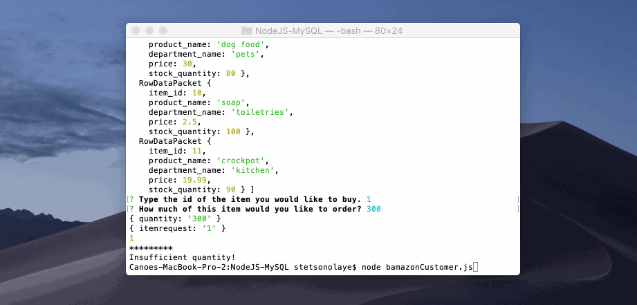

Introduction

I created an Amazon-like storefront app, called Bamazon, using MySQL, the MySQL NPM Package, and the Prompt Package.

This app takes in orders from customers and deplete from the store's total supplies.

The app first displays a list of all of the available products, their costs, and current stock. 

<<<<<<< HEAD

=======

>>>>>>> 4f6b8157e3f8ecebf99454e3ab531e920e5a93b8

The app asks the following things from the user.

product ID
the amount the user wants to purchase 

It must be ran in the command line.

Type in node bamazonCustomer.js to start the app.

These are the npm packages I used and are needed to run the app

fs package in node
inquirer
mysql
to install these npm packages run the following commands.

npm install prompt
npm install mysql
